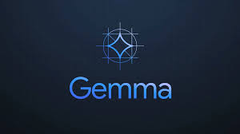

# Gemma Demo for Python Q&A
By Nicole Michaud
April 8th, 2024

## Introduction

This demo was created for the Kaggle competition "Google - AI Assistants for Data Tasks with Gemma".
In the notebook, I use Google's new open LLM model, Gemma, to answer common Python questions. 
The data I used to fine-tune this model for this purpose is from Python's FAQs page and contains 179 question-answer pairs and the categories they fall under.

## Methods
Using KerasNLP, I demonstrate how to initiate backend for the model (I used TensorFlow).
Next, I load Gemma's 2b model with a preprocessor that will handle text processing for you.

Then, I create sample prompts from the data to demonstrate how the model works at generating predictions/answers.

Using these sample prompts, we are able to see how the model performs without any fine-tuning. Some of the answers have some errors in them, or aspects that don't quite make sense.

### Fine Tuning

Using Low-Rank Adaptation (LoRA) I fine-tuned the model. This reduced the trainable parameters down from 2,506,172,416 to 1,363,968. This will greatly reduce the time and memory required for Gemma to run.

After fine-tuning, we can see that the inference from the model improves and it generates answers that make more sense than before.

## Next Steps
In order to further improve the performance and efficiency of this model, you can try out different values for the the hyperparameters used in fine-tuning the model.

## Conclusion
Google's new Gemma LLM models are lightweight and user friendly as they can be used with familiar APIs such as Keras. In this demo, I show you how to use Gemma with KerasNLP to answer common questions about the programming language Python! 